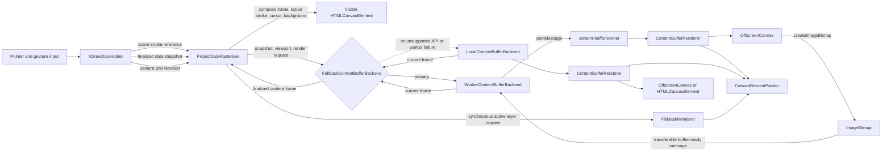
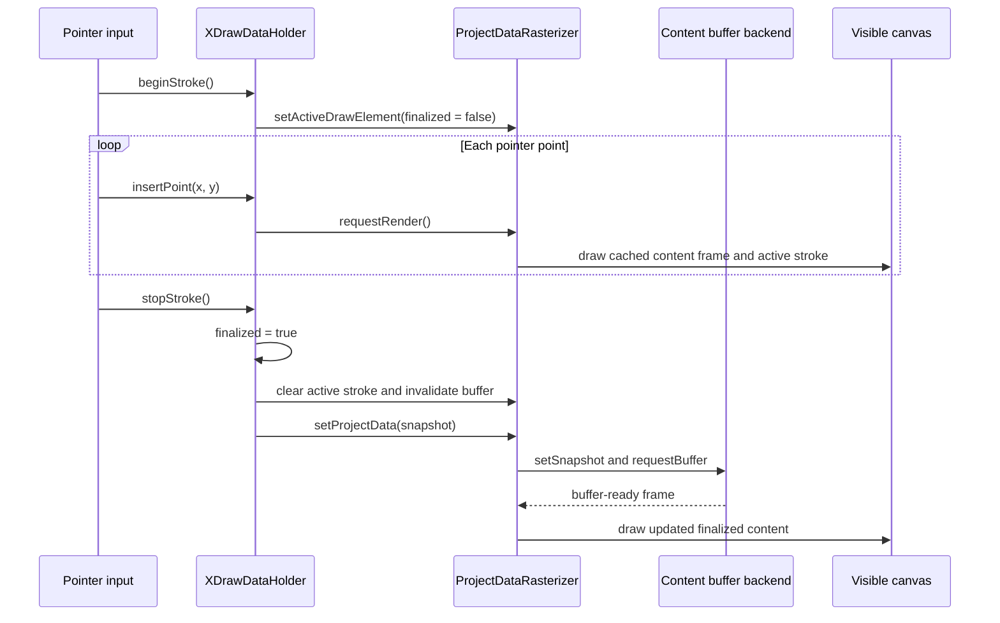

# XDraw Content Buffer Architecture

This document describes how XDraw renders finalized content in a Web Worker while keeping active strokes responsive on the main thread.

## Components

`CanvasElementPainter` is shared by worker rendering, local rendering, export, and fill-mask generation. Flood-fill masking remains synchronous on the main thread.

## Active Stroke Flow

Active points do not trigger `setSnapshot`. This avoids structured-cloning the growing stroke and the complete project for every pointer event. A snapshot is sent when the stroke is finalized or when a maximum-size stroke chunk is finalized.

## Consistency And Fallback

- `dataRevision` identifies the project snapshot.
- `renderRevision` identifies the camera and viewport state.
- Frames with stale revisions are discarded and their `ImageBitmap` is closed.
- The current frame stays visible while a newer asynchronous frame is being built.
- Worker startup and runtime failures permanently switch the backend instance to local rendering.
- Snapshots, viewport updates, and invalidations are mirrored to the local backend so fallback can continue immediately.
- Worker use requires `Worker`, `OffscreenCanvas`, `createImageBitmap`, and `Path2D` support.

## Message Direction

| Direction | Messages |
| --- | --- |
| Main thread to worker | `initialize`, `set-snapshot`, `set-viewport`, `invalidate`, `render` |
| Worker to main thread | `initialized`, `buffer-ready`, `error` |

The current protocol sends full snapshots at commit boundaries. Element-level upsert/delete messages can be added later if profiling shows that finalized snapshot transfer is still significant.